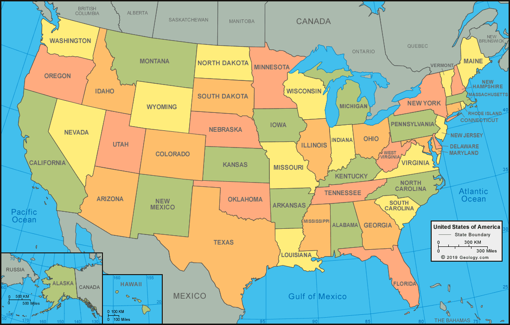
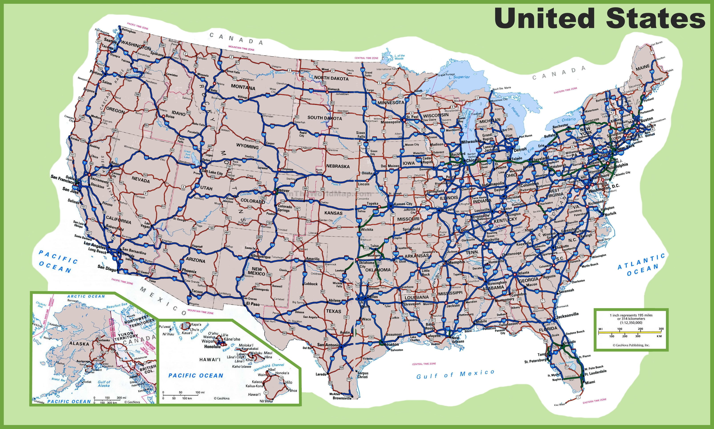
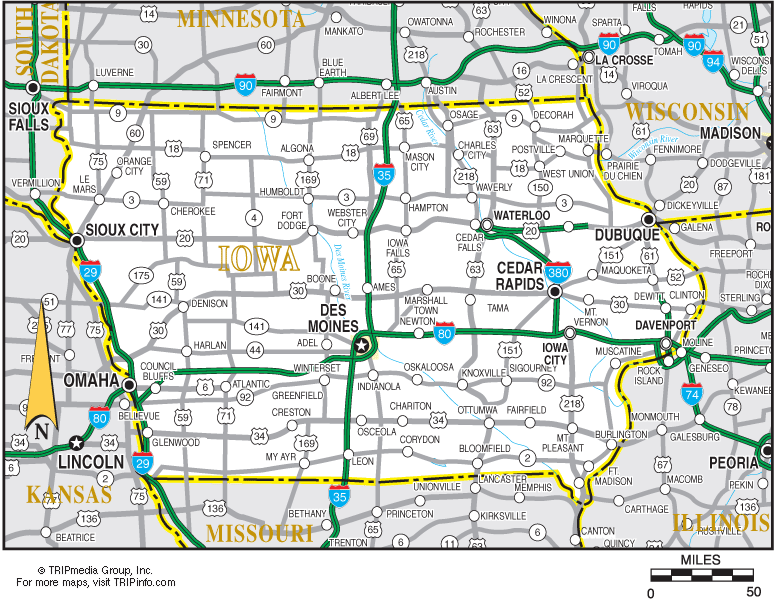
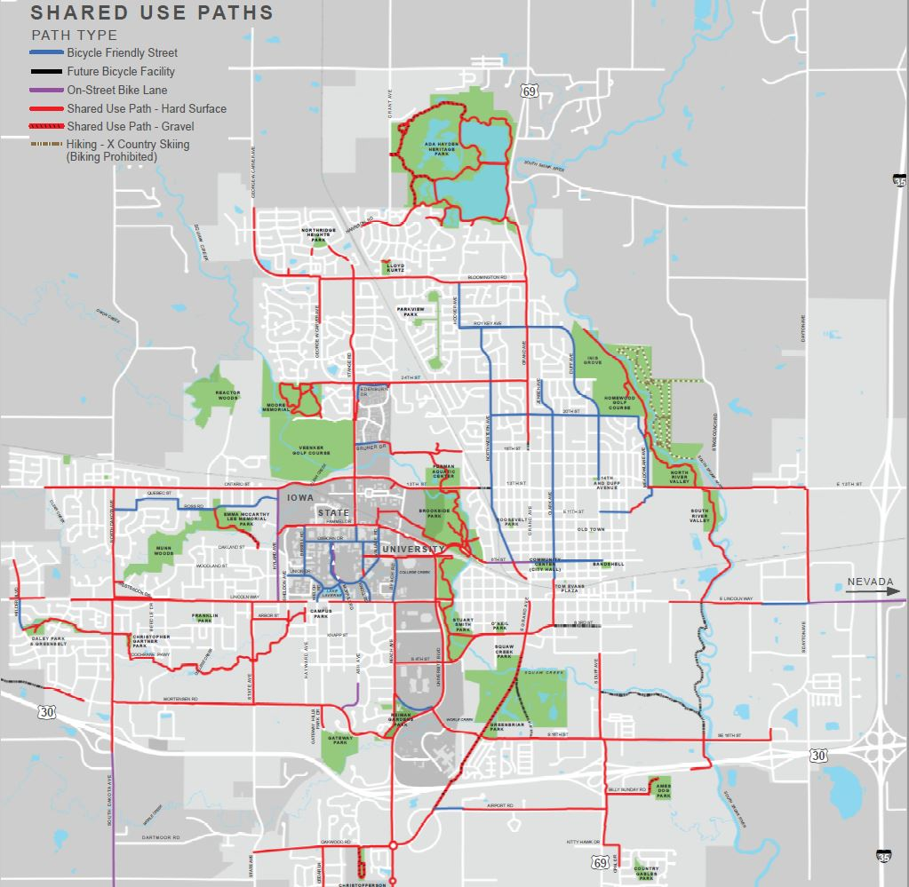
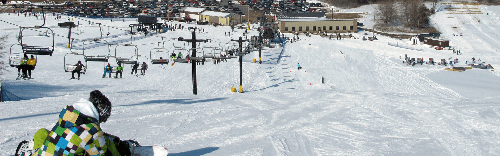

```{r setup, include=FALSE}
knitr::opts_chunk$set(echo = TRUE)
```

# Getting to Ames, IA!

## Getting to Ames by plane!

Arriving by plane at Des Moines International Airport (DSM)


## Schedule [Executive Express](https://www.executiveexpress.biz/shuttle-service) to Ames address!


Iowa Shuttle Service for 1 passenger is $57 as of 2021-07-12


## [Gratuity, i.e. tipping, guidelines](https://who13.com/news/gratuity-guidelines-who-to-tip-and-how-much/) 

### Tipping is optional, but ...

### Generally tip the following:

- Restaurant wait staff (15-20%)
- Taxi/Uber/Lyft drivers (10-15%)
- Hairstylist/Nail technician (15-20%)

### Tip is calculated before tax (Ames, IA tax rate is 7%)

### Menu prices do not inclue tax or tip


## Continental United States

{width=80%}


## Iowa (IA) in Midwest Census Region

{width=80%}


## Iowa in East North Central Climatic Region

{width=80%}

## Ames is in Story County, IA

{width=90%}


## Getting to Ames by car

{width=90%}


## Getting to Ames by car

{width=80%}


## Iowa - [top agricultural producer](https://www.iadg.com/iowa-advantages/target-industries/#:~:text=Value%2DAdded%20Agriculture%20%26%20Food%20Production,soybeans%20and%20red%20meat%20production.)

- largest producer of 

{width=24%}
{width=27%}
{width=35%}

- second largest producer of 

{width=20%}
{width=12%}
  
while being [26th in size and 30st in population](https://www.ipl.org/div/stateknow/popchart.html)


## Ames, IA - [one of the best places to live](https://www.amestrib.com/story/news/2020/10/16/ames-ranked-top-15-places-live/3678012001/)

{width=100%}


## Getting around Ames by car

{width=80%}


## [Getting around Ames by bike](https://www.thinkames.com/wp-content/uploads/2019/07/BikeMapDownloadReady-1.pdf)

{width=60%}


## [CyRide](https://www.cyride.com/) (bus, [free for ISU students](https://www.cyride.com/fares/fares))

{width=90%}


## [Getting a drivers license or Iowa ID](https://iowadot.gov/mvd/driverslicense/new-iowa-residents)

{width=100%}

[Foreign Born Citizens Resources](https://iowadot.gov/mvd/driverslicense/New-Iowan-Immigrant-and-Refugee-Resources)


## [Vehicle Registration](https://iowadot.gov/mvd/vehicleregistration/plates)

{width=100%}


## Learning to drive

??


## [Register to vote](https://sos.iowa.gov/elections/voterinformation/voterregistration.html)

{width=100%}


## Where to live

- Geographically
  - Anywhere in Ames
    - Above Bloomington Rd is Gilbert School District
- Type of accommodations
  - [University housing](https://www.housing.iastate.edu/halls-and-apartments/)
  - Apartment complex
  - House rental
  - Home purchase


## Where to live - geographically

{width=80%}


## [University Housing](https://www.housing.iastate.edu/halls-and-apartments/)

{width=70%}


## Apartment/House Search

- [Iowa Housing Search](https://iowahousingsearch.org/)

- [apartments.com](https://www.apartments.com/ames-ia/)
- [zillow.com](https://www.zillow.com/ames-ia/apartments/)
- [apartmentfinder.com](https://www.apartmentfinder.com/Iowa/Ames-Apartments)

- [Hunziker Property Management](https://www.hunziker.com/)

(no recommendations or endorsements are being made)


## [Rent Smart Ames](https://www.cityofames.org/living/rent-smart-ames)

{width=100%}


## Rental Quirks in Ames

- University housing has strict move-in/move-out dates
- Other rental agreements run Aug 1 to July 31
- other ???


## Utilities


### Natural gas
### Electricity/Water/Sewer
### Garbage/Recycling/Compost
### Cell phones
### Internet


## Natural gas from [Alliant Energy](https://www.alliantenergy.com/)

[Start service](https://www.alliantenergy.com/CustomerService/AlliantEnergyService/StartorStopService)

- Furnace/heat
- Gas stoves and ovens
- Fireplaces
- Laundry dryers


## City of Ames Electric

[Start service](https://www.cityofames.org/government/departments-divisions-i-z/utilities-and-parking-tickets/municipal-utilities-online-customer-service)

{width=90%}

1 of 3 power plants in the world that burn garbage to produce electricity


## Garbage/Recycling/Compost

### [Garbage collectors](https://www.cityofames.org/government/departments-divisions-i-z/resource-recovery-system/licensed-area-haulers)

Do not put glass or food waste in garbage. 
[Metal gets extracted by magnets.](https://www.cityofames.org/government/departments-divisions-i-z/resource-recovery-system)

### [Glass/can recycling](https://www.cityofames.org/government/departments-divisions-i-z/resource-recovery-system/glass-recycling)

- [Iowa has 5 cent bottle/can deposit](https://www.iowadnr.gov/Environmental-Protection/Land-Quality/Waste-Planning-Recycling/Bottle-Deposit-Law)
- [Redemption only available in Nevada, IA](https://www.iowadnr.gov/Portals/idnr/uploads/forms/5421215.pdf)???


### [Recycling collectors](https://www.cityofames.org/government/departments-divisions-i-z/resource-recovery-system/recycling-in-ames-and-story-county)

My understanding is most recycled materials are trucked to Des Moines and then
sent by rail out of state. 

### [Compost](https://www.cityofames.org/government/departments-divisions-i-z/resource-recovery-system/food-waste-diversion)

Free to do it yourself or curbside pickup by [Core Living Compost](https://corelivingcompost.com/)


## Cell phones

[Cell phone coverage](https://coveragecritic.com/coverage-model/best-cell-phone-coverage-plans-in-ames-ia/): 

{width=100%}


## Internet

- [DSL from Century Link](https://www.centurylink.com/)
- [Cable from Mediacom](https://www.mediacomcable.com/)
- [Fiber from Metronet](https://www.metronetinc.com/)


## Shopping, e.g. groceries

- [Farmer's Market](http://www.amesmainstreetfarmersmarket.com/)
- [Wheatsfield Co-op](https://www.wheatsfield.coop/) - [become a member ($100)](https://www.wheatsfield.coop/member-owner/)
- [HyVee](https://www.hy-vee.com/) - employee owned
- [Fareway](https://www.fareway.com/)
- [Aldi](https://www.aldi.us/)
- [Target](https://www.target.com/)
- [Wal-Mart](https://www.walmart.com/)

- Ames Asia Market West (west Ames)
- Ames Asian Market (north Ames)
- Asia Foods Store (downtown)


## Used furniture

- [Goodwill of Central Iowa](https://www.dmgoodwill.org/location/ames/)
- [Overflow Thrift Store](https://www.overflowthriftstore.org/)
- [Habitat Store](https://goo.gl/maps/4zhEgyusENqXm8k1A)


## News

- [Iowa State Daily](https://www.iowastatedaily.com/)
- [Ames Tribune](https://www.amestrib.com/)
- [Des Moines Register](https://www.desmoinesregister.com/)


## What to do in Ames - Summer


- [Furman Aquatic Center](https://www.cityofames.org/Home/Components/FacilityDirectory/FacilityDirectory/54/471?npage=2)
- [Reiman Gardens](https://www.reimangardens.com/)
- [City Parks](https://www.cityofames.org/government/departments-divisions-i-z/parks-recreation/park-system)
- [Ada Hayden Heritage Park Lake](https://www.cityofames.org/Home/Components/FacilityDirectory/FacilityDirectory/2/471)
- [Peterson Pits](https://www.mycountyparks.com/county/story/Park/Peterson-Park.aspx)
- 
- [Ledges State Park](https://www.iowadnr.gov/Places-to-Go/State-Parks/Iowa-State-Parks/Ledges-State-Park)


## [Furman Aquatic Center](https://www.cityofames.org/Home/Components/FacilityDirectory/FacilityDirectory/54/471?npage=2) - ($6/day for ISU Student)

{width=100%}


## [Reiman Gardens](https://www.reimangardens.com/) - (free for ISU students)

{width=70%}


## [Reiman Gardens](https://www.reimangardens.com/) - World's largest gnome

{width=70%}


## [Ada Hayden Heritage Park Lake](https://www.cityofames.org/Home/Components/FacilityDirectory/FacilityDirectory/2/471)

{width=70%}

## [Ada Hayden Heritage Park Lake](https://www.cityofames.org/Home/Components/FacilityDirectory/FacilityDirectory/2/471)

{width=50%}

## Ames weather - temperature/precipitation

{width=100%}

## Ames weather - winters

{width=90%}


## [Snow emergency routes](https://www.cityofames.org/government/departments-divisions-i-z/public-works/operations/snow-ordinance-and-removal)

{width=90%}


## Ames weather - thunderstorms/tornados

{width=90%}

[siren test first Wednesday of every month at 10am](https://www.cityofames.org/Home/Components/Calendar/Event/8898/31)


## What to do in Ames - All year

- [Ames Public Library](https://www.amespubliclibrary.org/)
- [Ames History Museum](https://ameshistory.org/)
- [Octagon Center for the Arts](https://octagonarts.org/)
- [Perfect Games](http://perfectgamesinc.com/PG/index.php/en/)
- [Seven Oaks Recreation](https://sevenoaksrec.com/)

- [Ames Community Theater](https://www.actorsinc.org/)
- [Iowa State Center](https://www.center.iastate.edu/events/)

- [Torrent Brewing Company](http://torrentbrewingco.com/)
- [Alluvial Brewing](https://www.alluvialbrewing.com/)
- [Prairie Moon Winery](https://prairiemoonwinery.com/)


## [Seven Oaks Recreation](https://sevenoaksrec.com/)

{width=100%}

# Questions?

## Slides online

all orientation slides are available at 

https://isustatistics.github.io/grad_orientation/

these slides are available at

https://isustatistics.github.io/grad_orientation/ames.html

