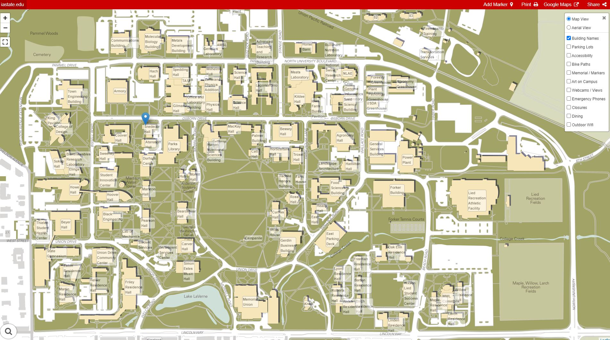

```{r setup, include=FALSE}
knitr::opts_chunk$set(echo = TRUE)
```

# Iowa State University


## [New Graduate Student Orientation](https://www.grad-college.iastate.edu/student/orientation/)

- New Graduate Student Orientation on Thursday, August 27 at 5 p.m.
- 


## Location

{width=80%}

## Campus in Ames

{width=80%}

## [Campus](https://www.fpm.iastate.edu/maps/)

{width=100%}


## [Parking](https://www.parking.iastate.edu/) ($160 / year)

{width=80%}

[Graduate student commuter (lot 29) permits on sale July 21, 2021](https://www.parking.iastate.edu/permit/student/dates)


## Free Parking on Nights and Weekends

- Generally permits required 
  - Monday - Friday 
  - 7 am - 5:30 pm


## Bicycles

- [Registration](https://www.parking.iastate.edu/permit/bike) (free)
  - recovering a stolen bike
  - contact owner if bike is abandoned
  - estimate biking population
- Use bike lock on bike rack

{width=40%}


## [CyRide](https://www.cyride.com) - [ISU Campus Route Map](https://www.cyride.com/maps/school-year-maps/isu-campus-route-map)

{width=80%}


## Organization

- People
- Colleges
  - Departments

## [ISU Organizational Chart](https://www.president.iastate.edu/sites/default/files/org/univorg.pdf)

{width=100%}


## College of Liberal Arts and Science

## College of Agriculture and Life Science


## Athletics

