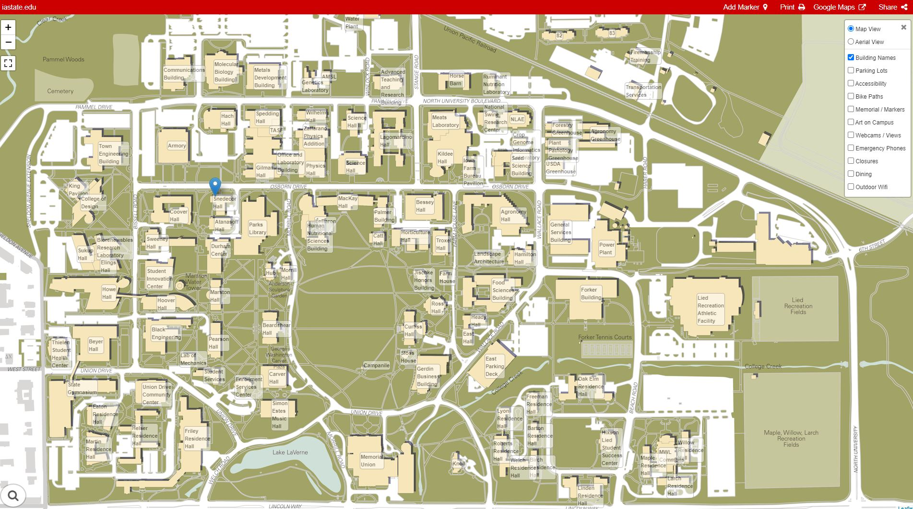

```{r setup, include=FALSE}
knitr::opts_chunk$set(echo = TRUE)
```

# Iowa State University


## Location

{width=80%}

## Campus in Ames

{width=100%}

## [Campus Maps](https://www.fpm.iastate.edu/maps/)

{width=90%}


## [Campanile](https://www.fpm.iastate.edu/maps/buildings/building.asp?id=19)


{width=60%}

Chimes can be heard every 15 minutes


## [Parking](https://www.parking.iastate.edu/) ($160 / year)

{width=80%}

[Graduate student commuter (lot 29) permits on sale July 21, 2021](https://www.parking.iastate.edu/permit/student/dates)


## Free Parking on Nights and Weekends

Generally permits required Monday - Friday, 7 am - 5:30 pm

{width=70%}


## Bicycles

- [Registration](https://www.parking.iastate.edu/permit/bike) (free)
  - recovering a stolen bike
  - contact owner if bike is abandoned
  - estimate biking population
- Use bike lock on bike rack

{width=40%}


## [CyRide](https://www.cyride.com) - [ISU Campus Route Map](https://www.cyride.com/maps/school-year-maps/isu-campus-route-map)

{width=80%}


# Organization


## Iowa State University

- In [Top 50 largest colleges and universities in U.S.](https://www.collegexpress.com/lists/list/the-50-largest-us-colleges-and-universities/361/)
  - ~30,000 undergraduate students
  - ~5,000 graduate students

{width=80%}


## [ISU Organizational Chart](https://www.president.iastate.edu/sites/default/files/org/univorg.pdf)

{width=100%}

## [President Wintersteen](https://www.president.iastate.edu/)

{width=90%}


## [Provost Wickert](https://www.provost.iastate.edu/)

{width=70%}


## [Dean Schmittman](https://las.iastate.edu/office-of-the-dean/) - [LAS](https://las.iastate.edu/)

{width=70%}


## [Dean Robison](https://www.cals.iastate.edu/about/administration) - [CALS](https://www.cals.iastate.edu/)

{width=70%}


## [Dean Graves](https://www.grad-college.iastate.edu/contact/) - [Graduate College](https://www.grad-college.iastate.edu/)

{width=70%}


# Athletics

## [Cyclones](https://cyclones.com/)

{width=100%}

## [Cy](http://historicexhibits.lib.iastate.edu/Cy/home.html) (mascot)

{width=80%}

## [Student Tickets](https://cyclones.com/sports/2015/3/2/GEN_201401015.aspx?path=general)

{width=90%}

## [Football Schedule](https://cyclones.com/sports/football/schedule)

{width=70%}

Traffic near [Jack Trice Stadium](https://cyclones.com/facilities/midamerican-energy-field-at-jack-trice-stadium/14) increases during home football games


# Get Involved


## [Student Organizations](https://www.stuorg.iastate.edu/)

{width=80%}

## [Graduate Student Organizations](https://www.stuorg.iastate.edu/organizations/28/type)

{width=80%}


## [Graduate and Professional Student Senate (GPSS)](https://www.gpss.iastate.edu/)

{width=80%}


## [R-Ladies Ames](https://www.meetup.com/rladies-ames/)

{width=80%}


# Large research university events

## [ISU Lecture Series](https://www.lectures.iastate.edu/)

{width=80%}

## [Iowa State Center Performing Arts Series](https://www.center.iastate.edu/broadway/)

{width=80%}


# Academics

## [Academic calendar](https://www.registrar.iastate.edu/calendar)

{width=80%}


## [Classes](https://classes.iastate.edu/)

{width=80%}


## [Course catalog](https://catalog.iastate.edu/)

{width=80%}


## [Registration](https://catalog.iastate.edu/registration/)

{width=80%}

## [ISU Card](https://www.isucard.iastate.edu/)

{width=80%}


## Searching

search for 

> iastate ...

for example

> iastate academic calendar


# Student Services


## [Student Services](https://catalog.iastate.edu/studentservices/)

{width=80%}


## [Thielen Student Health Services](https://health.iastate.edu/)

{width=80%}


## [Student Accessibility Services](https://sas.dso.iastate.edu/)

{width=80%}

## [Career Services](https://www.career.iastate.edu/)

{width=80%}


# Questions?


## Slides online

all orientation slides are available at 

https://isustatistics.github.io/grad_orientation/

these slides are available at

https://isustatistics.github.io/grad_orientation/isu.html