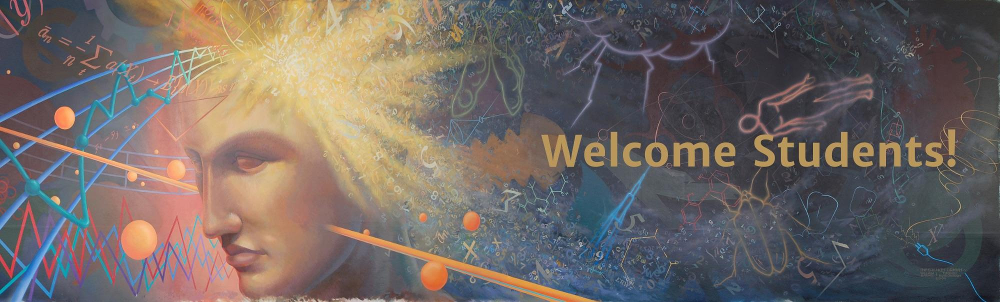

```{r setup, include=FALSE}
knitr::opts_chunk$set(echo = TRUE)
```

# Statistics @ ISU


## Campus Location

{width=80%}


## [Snedecor Hall](https://www.fpm.iastate.edu/maps/buildings/building.asp?id=119)

{width=80%}

## [Statistics](https://www.stat.iastate.edu/)

{width=80%}


## Main Office - 1121 Snedecor

- Department Chair: Dan Nettleton
- Associate Chair: Petrutza Caragea
- Administrative Assistant II: Kathy Kiesling 
- Graduate Secretary: Jessica Severe
- Communications Specialist: Macy Ott


## Additional staff

- IT Support - 2123 Snedecor
  - Information Technology Support III - Mike Brekke
  - Student Support - Thadeus Booth (summer 2021)
- 3113 Snedecor
  - Undergraduate Secretary: Denise Riker
- ? Atanasoff 
  - Communications: Macy Ott
- 386 Carver 
  - (Undergraduate) Academic Advisor: Dawn Walker-Chalmers

  
# People

## [Jess Severe](https://www.stat.iastate.edu/people/jessica-severe) - Graduate Secretary

<div style="float: left; width: 20%;">
{width=100%}
</div>

<div style="float: right; width: 80%;">
- She can answer all your questions.
- If she can't, she knows someone who can. 
</div>


## [Mike Brekke](https://www.stat.iastate.edu/people/michael-brekke) - IT Support

<div style="float: left; width: 20%;">
{width=100%}
</div>

<div style="float: right; width: 80%;">
- Computer-related questions
  - Email stat-tech@iastate.edu
</div>


## [Petrutza Caragea](https://www.stat.iastate.edu/people/petruta-caragea) - Associate Chair

<div style="float: left; width: 20%;">
{width=100%}
</div>

<div style="float: right; width: 80%;">
- TA/RA/Teaching Administrative Questions
</div>


## [Dan Nettleton](https://www.stat.iastate.edu/people/dan-nettleton) - Department Chair

<div style="float: left; width: 20%;">
{width=100%}
</div>

<div style="float: right; width: 80%;">
+ This text is on the right
</div>

  

## 


# Questions?


## Slides online

all orientation slides are available at 

https://isustatistics.github.io/grad_orientation/

these slides are available at

https://isustatistics.github.io/grad_orientation/stat.html