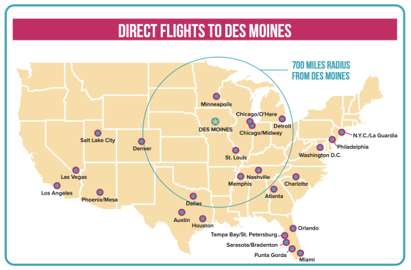
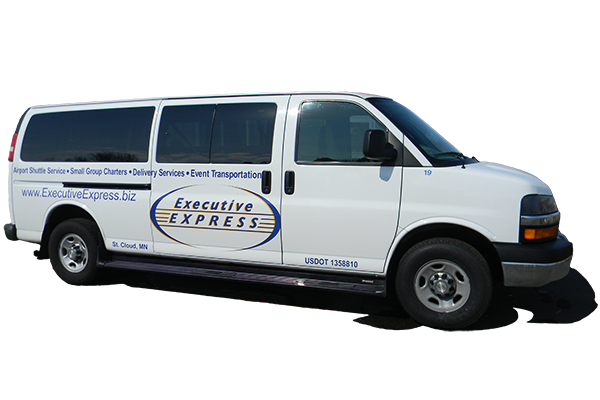
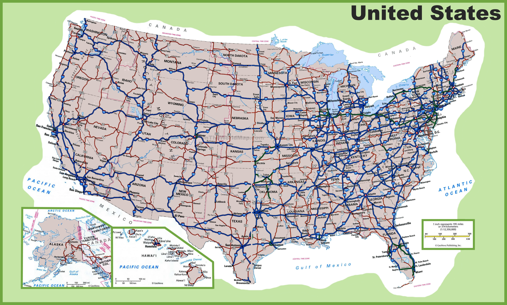
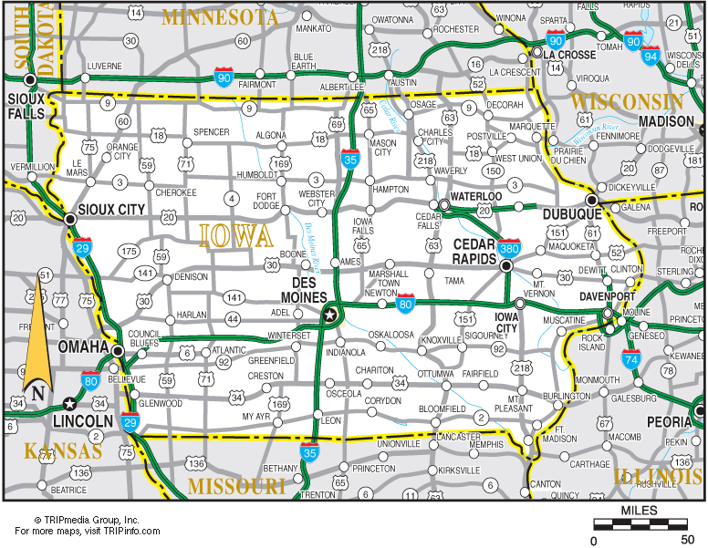
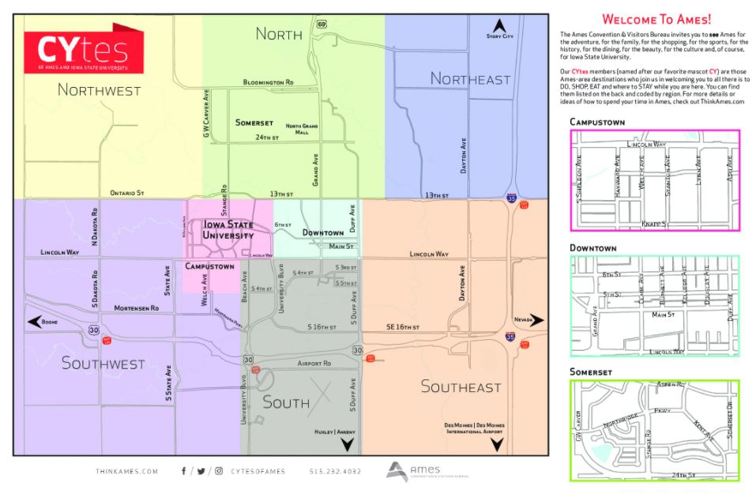
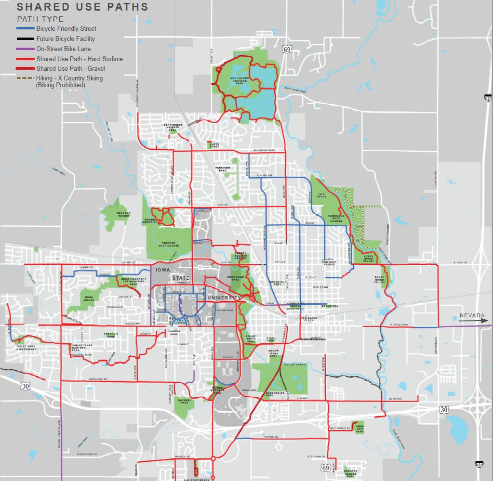
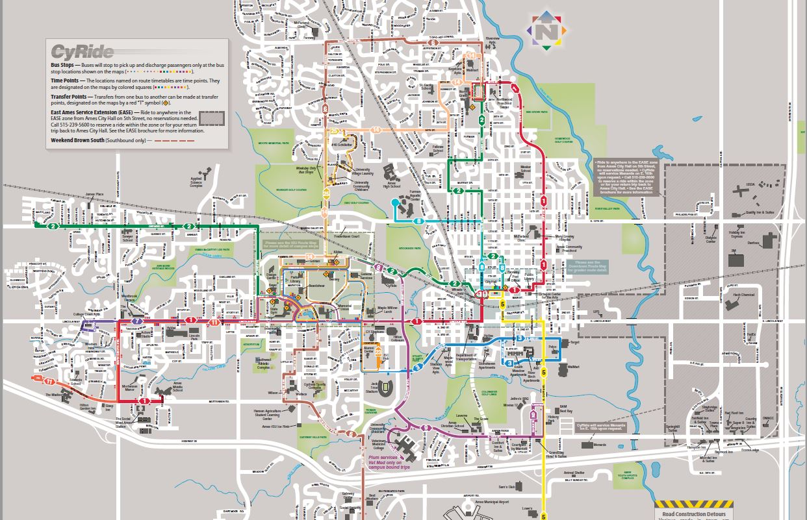

# Getting to Ames, IA!

## Getting to Ames by plane!

Arriving by plane at Des Moines International Airport (DSM)

## Schedule [Executive Express](https://www.executiveexpress.biz/shuttle-service) to Ames address!

Iowa Shuttle Service for 1 passenger is $57 as of 2021-07-12

## Getting to Ames by car!

{width=90%}

## Getting to Ames by car!

{width=80%}

## Getting around Ames by car

{width=80%}

## [Getting around Ames by bike](https://www.thinkames.com/wp-content/uploads/2019/07/BikeMapDownloadReady-1.pdf)

{width=60%}

## Getting around Ames by bus: [CyRide](https://www.cyride.com/)

{width=90%}

## Getting a drivers license

## Shopping

## Gratuity, i.e. tipping!

## Utilities

### Cell phones
### Electricity
### Water/Sewer
### Natural Gas

# Welcome to Iowa State University!

# Welcome to ISU Statistics!
